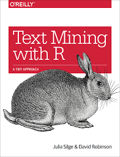
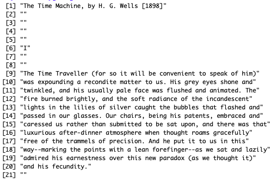
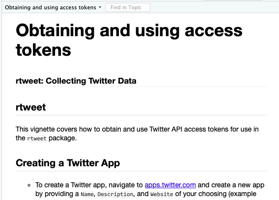

class: center, middle

# Text Mining in R

Andrew Stewart<br><br>
Division of Neuroscience and Experimental Psychology<br><br>
University of Manchester<br><br>
Email: andrew.stewart@manchester.ac.uk<br><br>
Twitter: @ajstewart_lang<br><br>

.pull-left[
```{r, echo=FALSE, out.width="100%"}

```
]

.pull-right[
```{r, echo=FALSE, out.width="50%"}
knitr::include_graphics("images/bsbr.jpg")
```
]

---
```{r setup, include=FALSE}
options(htmltools.dir.version = FALSE)
```

```{r, warning=FALSE, message=FALSE, echo=FALSE}
library(tidyverse)
library(rtweet)
library(grid)
library(visdat)
library(tidytext)
library(textdata)
library(gutenbergr)
library(igraph)
library(ggraph)
library(leaflet)
```
# Text Mining

There's a great book on text mining by Julia Silge and David Robinson all
written to work with data in Tidy format.

.pull-left[
```{r, echo=FALSE, out.height="25%"}

```
]

.pull-right[
```{r, echo=FALSE, out.height=180, out.width=180}


```
]
---
# What we'll cover today...

Summarising text data.

Sentiment analysis.

Extracting frequency information (and demonstrating Zipf's law).

Characterising text that plays a unique contribution in two different corpora.

N-gram analysis.

Scraping Twitter and visualising Twitter data.

---
# Downloading some text data

We are going to download from Project Gutenberg the text of four books by 
HG Wells. We will combine these four books into a dataframe called 'books'.
```{r, warning=FALSE, message=FALSE}
titles <- c("The War of the Worlds",
            "The Time Machine",
            "Twenty Thousand Leagues under the Sea", 
            "The Invisible Man: A Grotesque Romance")

books <- gutenberg_works(title %in% titles) %>%
  gutenberg_download(meta_fields = "title")
```
---
# Visualising the dataframe
```{r, eval=FALSE}
vis_dat(books)
```

.center[
```{r, echo=FALSE, fig.height=6, fig.width=10}
vis_dat(books)
```
]
---
```{r, eval=FALSE}
books$text
```

```{r, echo=FALSE}

```
---
Currently the text is all in one column in our dataframe - we need to transform 
it into tidy format such that one word appears in each row. We do this by 
'unnesting' the text column and removing 'stop words'. These are common words
(e.g., function words like 'the' and 'of').

```{r}
all_text <- books %>%
  unnest_tokens(word, text) %>%
  anti_join(stop_words) 
head(all_text)
```

---
# Summary Data of the Corpus

```{r}
all_text %>%
  group_by(title, word) %>%
  count(sort = TRUE) %>%
  ungroup() %>%
  top_n(8)
```
---
# Summary Data of War of the Worlds

```{r, message=FALSE}
all_text %>%
  filter(title == "The War of the Worlds") %>%
  group_by(word) %>%
  tally(sort = TRUE) %>%
  top_n(10)
```
---
class: center, middle
```{r, echo=FALSE,  fig.height=8, fig.width=10, message=FALSE, fig.retina=2}
all_text %>%
  filter(title == "The War of the Worlds") %>%  
  count(word) %>%
  top_n(10) %>%
  mutate(word = reorder(word, n)) %>%
  ggplot(aes(x = word, y = n, fill = word)) +
  geom_col() +
  coord_flip() +
  guides(fill = FALSE) +
  labs(title = "Top 10 words in The War of the Worlds", 
       x = "Word",
       y = "Count") +
  theme(text = element_text(size = 20))
```

---
# Sentiment Analysis 

We can use one of the sentiment databases built-in to the tidytext package. The 
'bing' database has sentiment ratings (positive vs. negative) for almost 7,000 
words.

```{r}
get_sentiments("bing")
```
---
We can 'join' our books dataframe to this database using the inner_join() 
function from the dplyr package.

```{r}
all_text_sent <- all_text %>%
  inner_join(get_sentiments("bing")) 
head(all_text_sent)
```
---
```{r, eval=FALSE}
all_text_sent %>%
  filter(title == "The War of the Worlds") %>%
  count(word, sentiment, sort = TRUE) %>%
  top_n(25) %>%
  mutate(n = ifelse(sentiment == "negative", -n, n)) %>%
  mutate(word = reorder(word, n)) %>%
  ggplot(aes(x = word, y = n, fill = sentiment)) +
  geom_col() +
  coord_flip() +
  labs(title = "Sentiment Analysis of Top 25 Words in
       The War of the Worlds", 
       x = "Word",
       y = "Count") +
  theme(text = element_text(size = 20))

```
---
```{r echo=FALSE, fig.height=8, fig.width=10, fig.retina=2, message=FALSE}
all_text_sent %>%
  filter(title == "The War of the Worlds") %>%
  count(word, sentiment, sort = TRUE) %>%
  top_n(25) %>%
  mutate(n = ifelse(sentiment == "negative", -n, n)) %>%
  mutate(word = reorder(word, n)) %>%
  ggplot(aes(x = word, y = n, fill = sentiment)) +
  geom_col() +
  coord_flip() +
  labs(title = "Sentiment Analysis of Top 25 Words in \nThe War of the Worlds", 
       x = "Word",
       y = "Count") +
  theme(text = element_text(size = 20))
```
---
# Examining proprtion of usage of each word

```{r}
book_words <- all_text %>% 
  group_by(title) %>% 
  count(title, word, sort = TRUE)

total_words <- book_words %>% 
  group_by(title) %>% 
  summarise(total = sum(n))

book_words <- left_join(book_words, total_words)
```
---

```{r}
book_words %>%
  mutate(proportion = n/total) %>%
  group_by(title) %>%
  arrange(desc(proportion)) %>%
  top_n(3) %>%
  select(-n, -total)
```
---
# Visualizing the data - Zipf's Law

```{r, echo=FALSE, message=FALSE, warning=FALSE, fig.width=10}
book_words %>%
  ggplot(aes(x = n/total, fill = title)) +
  geom_histogram(show.legend = FALSE) +
  xlim(NA, 0.0009) +
  facet_wrap(~title, ncol = 2, scales = "free") +
  theme(text = element_text(size = 20))
```
---
# Which words are most important (and unique) to each book?

The bind_tf_idf() function works out the important words for each book by adding 
a weighting to each word - decreasing the weight for commonly used words and 
increasing the weight for words not used much in the overall corpus.

This allows us to identify what words tend to be uniquely associated with each
of the four books.

```{r}
book_words <- book_words %>%
  bind_tf_idf(word, title, n)
```

---
```{r, eval = FALSE}
book_words %>%
  group_by(title) %>%
  top_n(15) %>%
  ungroup %>%
  ggplot(aes(x = reorder(word, tf_idf), y = tf_idf, fill = title)) +
  geom_col(show.legend = FALSE) +
  labs(x = NULL, y = "tf_idf") +
  facet_wrap(~title, ncol = 2, scales = "free") +
  coord_flip() +
  theme(text = element_text(size = 20))
```
---
```{r, echo=FALSE, message=FALSE, fig.width=10}
book_words %>%
  group_by(title) %>%
  top_n(15) %>%
  ungroup %>%
  ggplot(aes(x = reorder(word, tf_idf), y = tf_idf, fill = title)) +
  geom_col(show.legend = FALSE) +
  labs(x = NULL, y = "Term frequency and inverse document frequency") +
  facet_wrap(~title, ncol = 2, scales = "free") +
  coord_flip() +
  theme(text = element_text(size = 15))
```
---
# N-gram tokenizing

So far we've unnested such that each word is separate. But we can also unnest
by n-grams to capture sequences of words. In this example, let's look at 
tokenizing by bigram.

```{r, warning=FALSE}
wells_bigrams <- books %>% 
  filter(title == "The War of the Worlds") %>%
  unnest_tokens(bigram, text, token = "ngrams", n = 2)

bigrams_separated <- wells_bigrams %>%
  separate(bigram, c("word1", "word2", sep = " "))

bigrams_filtered <- bigrams_separated %>%
  filter(!word1 %in% stop_words$word) %>%
  filter(!word2 %in% stop_words$word)

bigrams_counts <- bigrams_filtered %>%
  count(word1, word2, sort = TRUE)
```
---
# Top bigrams in War of the Worlds
```{r, echo=FALSE}
bigrams_counts %>% top_n(10)
```
---
# War of the Worlds bigram network graph
```{r, echo=FALSE, fig.width=10}
bigram_graph <- bigrams_counts %>%
  filter(n > 5) %>%
  graph_from_data_frame()

set.seed(1234)
ggraph(bigram_graph, layout = "fr") +
  geom_edge_link() +
  geom_node_point() +
  geom_node_text(aes(label = name), vjust = 1, hjust = 1, size = 8) +
  guides(size = FALSE) +
  xlim(10, 22) +
  theme_void() 
```

---
# Scraping Twitter
The package `rtweet()` by Mike Kearney allows us to scrape Twitter for data. 
First you need to set up a Twitter API access token.
Full instructions are provide in one of the rtweet vignettes - there are two
methods with the "2. Access token/secret method" the more straightforward:

```{r, eval=FALSE}
vignette("auth")
```

```{r, echo=FALSE, out.width="85%"}

```
---
# Visualising Data from Twitter

Scraping Twitter using the rtweet() package for everyone's favourite progressive 
Swedish death metal band, Opeth! 🤘  

```{r, eval = FALSE}
library(rtweet)
```

The code below uses the search_tweets() function from the rtweet package. The
first parameter is the query to be searched for, n is the number of tweets
to return. By setting include_rts to FALSE we are ignoring re-tweets that 
mention "Opeth". retryonratelimit means that if we get timed out by the Twitter
API, the code will pause until the limit resets.

```{r, echo=TRUE, message=FALSE, warning=FALSE}
tweets <- search_tweets(q = "Opeth", n = 2000, 
                        include_rts = FALSE, 
                        retryonratelimit = TRUE) 
```

---

Let's tidy the dataframe to separate out the data and time of each tweet, plus
select only a small number of columns we're interested in.

```{r}
tweets <- tweets %>% 
  separate(col = created_at, into = c("date", "time"), 
           sep = " ") %>%
  select(screen_name, date, time, text, 
         coords_coords, bbox_coords, geo_coords)
```

---
The Tweets dataframe looks like this:
.center[
```{r, fig.height=6, fig.width=10}
vis_dat(tweets)
```
]
---
```{r, eval=TRUE, echo=FALSE, fig.height=9, fig.width=11}
img <- jpeg::readJPEG("images/opeth.jpg")
g <- rasterGrob(img, interpolate=TRUE) 

ggplot(tweets, aes (x = date)) + 
  annotation_custom(g, xmin = -Inf, xmax = Inf, 
                    ymin = -Inf, ymax = Inf) +
  geom_bar(fill = "white", alpha = .5) + 
  labs(x = "Date", y = "Number of Tweets") + 
  theme(axis.text.x = element_text(angle = 45, hjust = 1)) +
  labs(title = paste("Tweets Mentioning Opeth Scraped On", 
                     Sys.Date()),
       subtitle = "Using Mike Kearney's rtweet package") +
  theme(text = element_text(size = 20))
```

---
class: centre

# Geospatial Plotting of Tweets

```{r, echo=FALSE}
my_map <- lat_lng(tweets)
to_plot <- leaflet(my_map) %>% 
  addTiles()
```

.center[
```{r, echo=FALSE, message=FALSE, warning=FALSE, fig.height=6, fig.width=8}
to_plot %>% addCircles(lng = ~lng, lat = ~lat, weight = 8, radius = 40, 
                 color = "#fb3004", stroke = TRUE, fillOpacity = 0.8)
```
]

---
# Scraping Individual Timelines

Let's get the last 1,000 Tweets by the authors Stephen King and Neil Gaiman.

```{r}
timeline_tweets <- 
  get_timeline(user = c("neilhimself", "StephenKing"), 
                n = 1000, max_id = NULL, home = FALSE, 
                parse = TRUE, check = TRUE)
```

---
# Top 20 words in each author's Tweets
```{r, echo=FALSE, fig.height=7, fig.width=11, message=FALSE}
timeline_tweets %>%
  filter(is_retweet == FALSE) %>%
  group_by(screen_name) %>%
  unnest_tokens(word, text) %>%
  anti_join(stop_words) %>%
  filter(word != "https" & word != "t.co") %>%
  count(word, sort = TRUE) %>%
  top_n(20) %>%
  ggplot(aes(x = reorder(word, n), y = n)) +
  geom_col(aes(fill = screen_name)) +
  coord_flip() +
  facet_wrap(~screen_name, scales = "free") +
  guides(fill = FALSE) +
  labs(x = NULL) +
  theme(text = element_text(size = 20))
```

---
# Which words characterise Neil Gaiman's vs. Stephen King's Tweets?

```{r, echo=FALSE, fig.height=5, fig.width=11, message = FALSE}
tweet_words <- timeline_tweets %>% 
  filter(is_retweet == FALSE) %>%
  unnest_tokens(word, text) %>%
  anti_join(stop_words) %>%
  filter(word != "https" & word != "t.co") %>%
  group_by(screen_name) %>% 
  count(screen_name, word, sort = TRUE)

total_tweets <- tweet_words %>% 
  group_by(screen_name) %>% 
  summarise(total = sum(n))

tweet_words <- left_join(tweet_words, total_tweets)

tweet_words <- tweet_words %>%
  bind_tf_idf(word, screen_name, n)

tweet_words %>%
  group_by(screen_name) %>%
  top_n(15) %>%
  ungroup %>%
  ggplot(aes(x = reorder(word, tf_idf), y = tf_idf, fill = screen_name)) +
  geom_col(show.legend = FALSE) +
  labs(x = NULL, y = "Term frequency and inverse document frequency") +
  facet_wrap(~screen_name, ncol = 2, scales = "free") +
  coord_flip() +
  theme(text = element_text(size = 20))
```

---
# At what time do the authors Tweet?

```{r, echo=FALSE, fig.height=7, fig.width=11}
timeline_tweets %>% 
  filter(is_retweet == FALSE) %>%
  separate(col = created_at, into = c("date", "time"), sep = " ") %>%
  mutate(time = parse_time(time)) %>%
  ggplot(aes(x = time)) +
  geom_histogram(alpha = .5, bins = 24) +
  facet_wrap(~screen_name, ncol = 1, scales = "free") +
  labs(x = "Time of Day Tweet Created", y = "Number of Tweets") +
  theme(text = element_text(size = 20))
```

---
# Neil Gaiman's Tweets by source

```{r, echo=FALSE, fig.height=7, fig.width=11}
timeline_tweets %>% 
  filter(screen_name == "neilhimself") %>%
  separate(col = created_at, into = c("date", "time"), sep = " ") %>%
  mutate(time = parse_time(time)) %>%
  ggplot(aes(x = time)) +
  geom_histogram(alpha = .5, bins = 24) +
  facet_wrap(~source) +
  theme(text = element_text(size = 20))
```

---
# That was a fully reproducible talk (just add my accent)

All slides and R code used to generate these slides available 
[here](https://github.com/ajstewartlang/Chester_text_mining_R)

<br />

```{r, echo=FALSE, out.height="50%"}

```

<br />

Slides created via the R package [**xaringan**](https://github.com/yihui/xaringan), [**knitr**](http://yihui.name/knitr), and [R Markdown](https://rmarkdown.rstudio.com).
